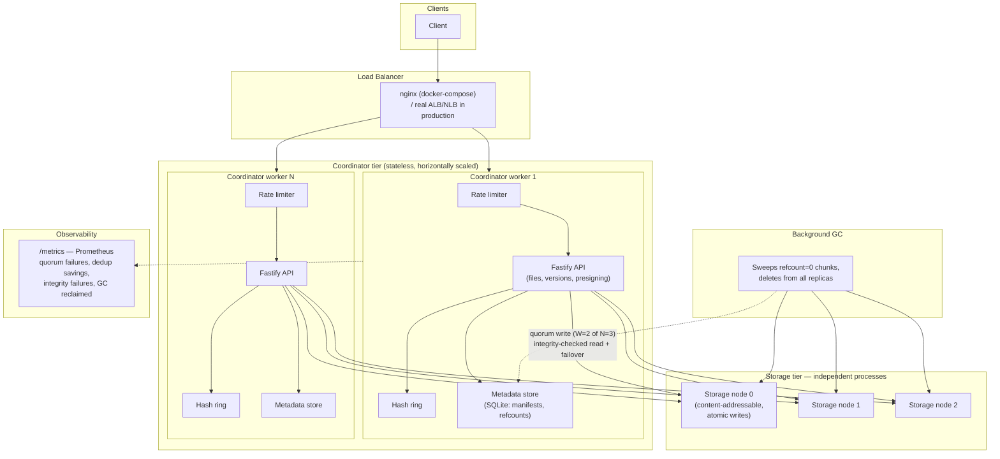

# Distributed Object Store

A content-addressable, replicated object storage system — the same shape
as the storage tier behind S3, Dropbox's Magic Pocket, and Facebook's
Haystack — built to actually survive a storage node dying mid-request, not
just serve as a CRUD-over-a-file-share demo.

**Real, reproducible results:** quorum replication survives a killed
storage node with **zero failed requests and zero data loss**; content-
addressable dedup saves **39% of storage** for two files sharing a common
asset. See [BENCHMARK.md](./BENCHMARK.md) for full numbers, methodology,
and exactly how to reproduce every one of them.

## Why this design

"Design Dropbox/S3" is a well-worn system-design interview question, but
most take-home answers stop at "chunk the file, hash each chunk, store by
hash." That gets you deduplication, but none of the actual distributed-
systems problems a real storage tier has to solve:

- **A single storage node is a single point of failure.** This system
  replicates every chunk to N=3 independent storage-node *processes*,
  placed via a [consistent-hashing ring](./src/hashRing.js) with virtual
  nodes (Dynamo/Ketama-style) so adding or removing a node only reshuffles
  the minority of keys near it — not the whole keyspace, the way naive
  `hash(key) % nodeCount` placement would.
- **Replication only helps if reads and writes know how to use it.** Writes
  succeed once **W=2 of N=3** replicas ack (Dynamo-style quorum) rather
  than waiting for the slowest node. Reads walk the ring's ordered
  preference list and **fail over to the next replica** on a network error,
  a timeout, *or* a corrupt on-disk copy — verified by re-hashing every
  chunk's bytes against its content address before returning it.
- **Deduplication and garbage collection fight each other if you're not
  careful.** The same chunk hash can legitimately be referenced by many
  unrelated files. GC only deletes a chunk once its **global** reference
  count — across every version of every file — reaches zero; see
  [Finding: a real bug](#finding-a-real-bug) below for what goes wrong when
  that global check is skipped.
- **A storage tier needs to prove it survives failure, not just claim to.**
  [`benchmark/resilience-test.js`](./benchmark/resilience-test.js) spins up
  a real 3-process cluster, sends `SIGKILL` to one storage node mid-run,
  and asserts reads and writes both still succeed — against actual killed
  OS processes, not a mocked failure.

## Architecture



## Finding: a real bug

The first version of `PUT /files/:fileId` (committing a new version of an
existing file) tried to reclaim space immediately instead of waiting for
the next GC sweep: any chunk in the *old* version's manifest that wasn't in
the *new* manifest got deleted from all replicas right away.

That's correct for a file that owns its chunks exclusively — and silently
wrong the moment two different files share a chunk through dedup. Updating
file A to drop a chunk it no longer needs would delete that chunk from
every replica even if file B's manifest still pointed at the exact same
hash, corrupting file B's download with zero warning.

Found via [`test/dedupCorruption.test.js`](./test/dedupCorruption.test.js):
upload two files sharing one chunk, update one of them, then show the
*other*, untouched file breaks. Fixed by removing the eager cross-replica
delete from the request path entirely and routing all physical deletion
through [`gc.js`](./src/gc.js), which only ever acts on the metadata
store's **global** reference count — the one source of truth for "is any
live version of any file still pointing at this chunk."

## API

| Method | Path | Description |
|---|---|---|
| `POST` | `/files` | Upload raw bytes as a new file. Chunks, replicates (quorum W of N), and commits the first version. |
| `PUT` | `/files/:fileId` | Commit a new version of an existing file. |
| `GET` | `/files/:fileId` | File metadata + version history. |
| `GET` | `/files/:fileId/download` | Reconstructs and returns the current version's bytes. |
| `POST` | `/files/:fileId/presign-download` | Returns a time-limited, HMAC-signed download URL. |
| `GET` | `/files/:fileId/download-presigned` | Fulfills a presigned download URL. |
| `GET` | `/health` | Liveness probe. |
| `GET` | `/metrics` | Prometheus exposition format. |

Each storage node additionally exposes `PUT`/`GET`/`DELETE /chunks/:hash`,
`/health`, and `/stats` — but nothing outside the coordinator ever talks to
these directly in a real deployment.

## Running it

```bash
npm install

# Terminal 1: bring up a 3-node local storage cluster
npm run start:nodes

# Terminal 2: start the coordinator (single process)
npm run start:coordinator
# ...or multi-process, one worker per CPU core:
npm run start:cluster

# Unit + integration tests (36 tests: chunking, atomic writes, the hash
# ring, global refcounting, presigning, rate limiting, GC, and full
# upload/download/dedup round-trips against real spawned storage nodes):
npm test

# Benchmarks (each spins up and tears down its own real cluster):
npm run benchmark             # read + write throughput
npm run benchmark:resilience  # kill a node mid-run, prove quorum survives
npm run benchmark:dedup       # real bytes-saved measurement
```

### Running the full cluster behind a load balancer

```bash
docker compose up --build
# hits nginx at :8080, which load-balances across 2 coordinator replicas,
# which in turn replicate every chunk across the 3 storage-node containers
```

## Scaling beyond this reference deployment

- **SQLite metadata → a real metadata service.** Every coordinator worker
  here shares one SQLite file (WAL mode, so readers don't block on a
  writer) — fine at this scale, but effectively one writer at a time in
  the limit. A production deployment swaps this for Postgres, DynamoDB, or
  a purpose-built metadata service (this is exactly the seam GFS/Colossus
  draws between chunkservers and the master, and Haystack draws between
  storage machines and the directory).
- **Static topology → real service discovery.** `STORAGE_NODES` is a
  static env var here; a real deployment reads cluster membership from
  Consul/etcd/Kubernetes and updates the hash ring as nodes join or leave,
  which is exactly what consistent hashing with virtual nodes is designed
  to make cheap.
- **Fixed-size chunking → content-defined chunking.** Fixed-size chunks
  (256 KiB) dedup perfectly for "the same file twice" or "the same asset
  embedded in two files," but a single byte inserted near the start of a
  huge file shifts every chunk boundary after it. Content-defined chunking
  (Rabin fingerprinting, as in LBFS/rsync/restic) fixes that at the cost of
  variable-size chunks.
- **N=3 fixed replication → configurable per-object durability.** Cold,
  rarely-accessed data doesn't need the same replication factor as hot
  data — a real system would let replication factor and placement vary by
  object class, the way S3 storage classes do.
- **One data-center topology → cross-region replication.** The preference-
  list model generalizes directly to "N replicas, at least one per region"
  for disaster recovery; the quorum math doesn't change, only the ring's
  node metadata (which now includes a region label).

## Stack

Node.js + [Fastify](https://fastify.dev/) for both the coordinator and
storage-node HTTP layers, `node:sqlite` (built into Node 22+, no native
compile step) for metadata, `prom-client` for metrics, a dedicated `undici`
`Agent` for the coordinator's internal fan-out calls, `autocannon` plus a
small hand-rolled concurrent-worker harness for load testing. No external
database, message queue, or cache is required to run or benchmark this
project.

## License

MIT
